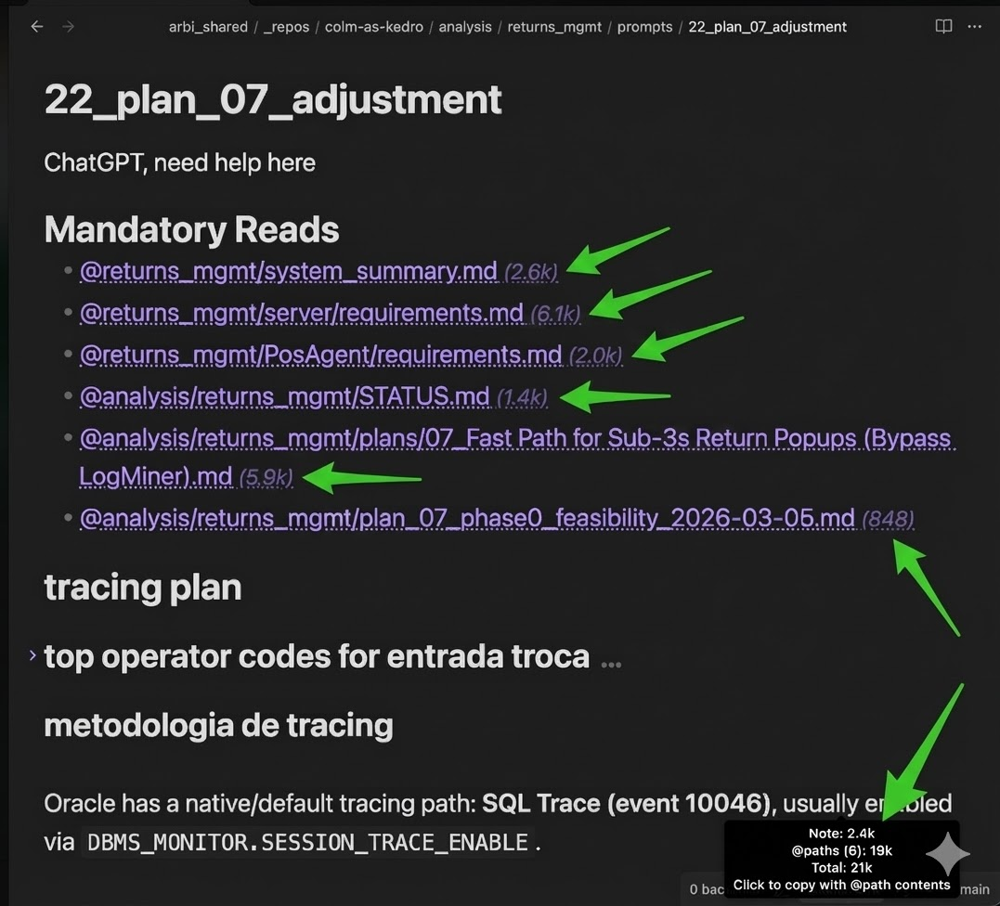
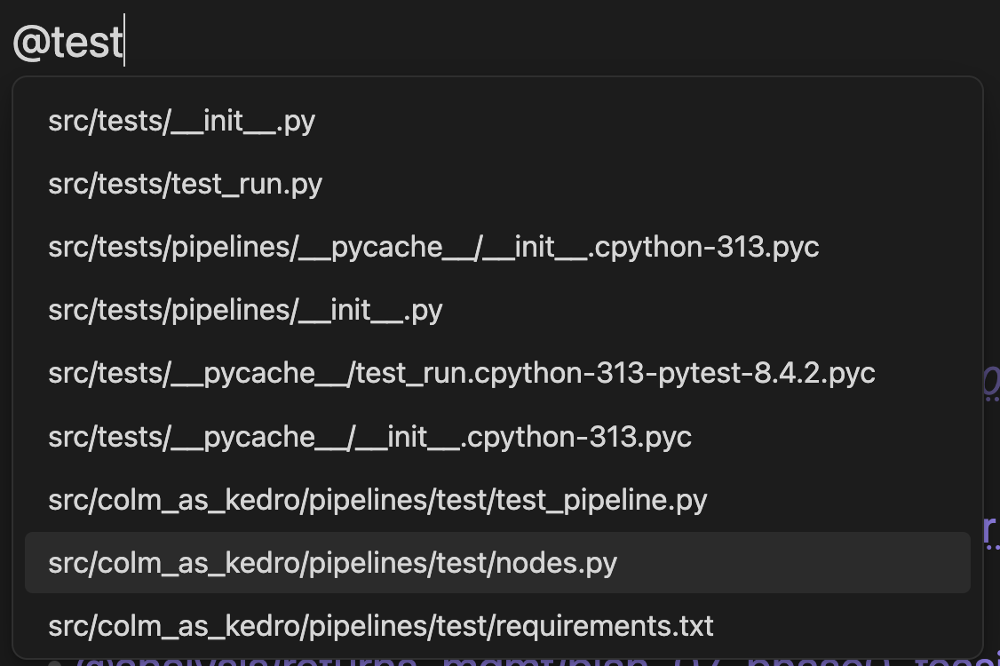
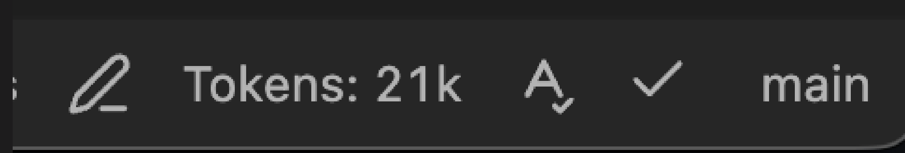
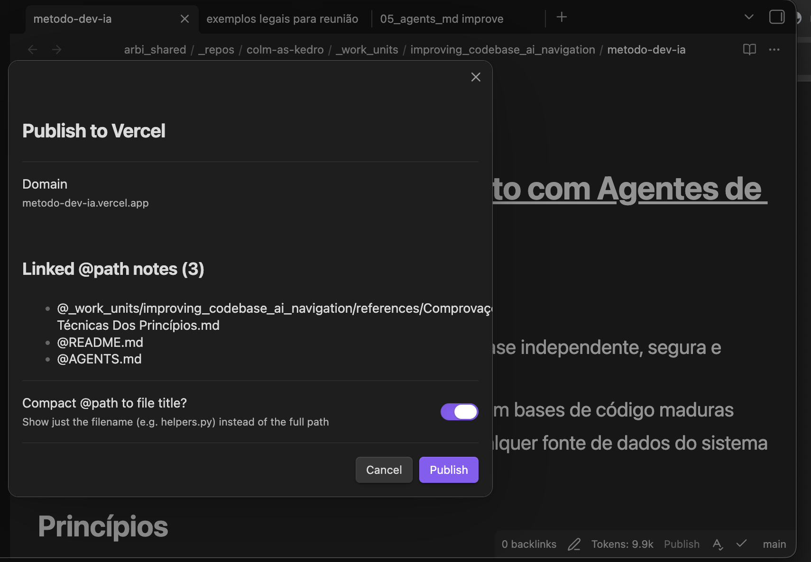
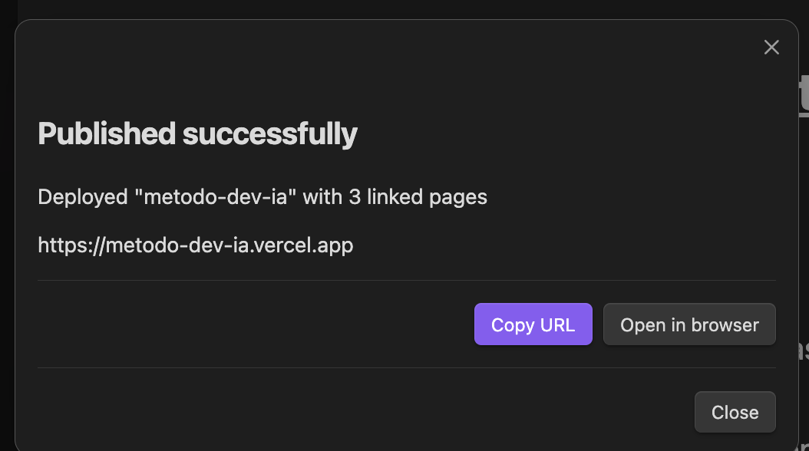

# AtPath

**Reference any file in your vault with `@path/to/file` — the same syntax used by AI coding tools.**

Autocomplete, click-to-open, token counting, one-click publish to the web, and cross-repo support.

---

  

## Features

### @ Autocomplete

Type `@` and pick any file. Works across repos — files from the current repo appear first, then cross-repo matches (`@other-repo/src/file.py`), then loose vault files.

  

### Clickable Links

Click any `@path` in Live Preview or Reading mode to open the file inside Obsidian. Right-click to open in your default external app.

### Token Counts

See how many tokens each `@path` reference adds — inline badges and a status bar total. Uses the GPT-4o tokenizer as an estimate. Click the status bar to copy everything to clipboard.

  

### Copy Note + @path Contents

One command (or click the status bar) to copy the current note with all referenced file contents appended — ready to paste into any web LLM. Each file appears under a `## @path` header in fenced code blocks.

### Publish to Vercel

Deploy any note as a styled dark-themed web page with one click. Before publishing, a confirmation modal shows the target domain, all linked `@path` notes, and a toggle to compact file paths to just filenames.

  

After deploying, a result modal gives you the URL with **Copy** and **Open in browser** buttons.

  

Published pages include collapsible sections, foldable bold list items, inlined local images, a download button, and a configurable contact button.

### Cross-Repo References

Reference files across different repos with `@reponame/path/to/file.ext`. Renames propagate automatically. Inside `_repos/`, paths are repo-relative; the first segment of a cross-repo path is matched against known repo names.

### Auto-Update References

Rename or move a file and all `@path` references across the vault update automatically — same-repo, cross-repo, and vault-relative formats.

## Settings

| Setting | Default | Description |
|---------|---------|-------------|
| Show token counts | On | Inline badges + status bar total |
| Max file size (MB) | 5 | Skip token counting above this |
| Vercel API token | — | For one-click publishing |
| Contact URL | — | Button link on published pages |
| Contact button label | Entre em contato | Button text |

## Install

- **Community Plugins** — search "AtPath" in Obsidian settings
- **Manual** — copy `main.js`, `manifest.json`, `styles.css` to `.obsidian/plugins/atpath/`, then enable

## Contributing

Contributions are welcome! Feel free to open issues or submit pull requests.

## License

MIT
